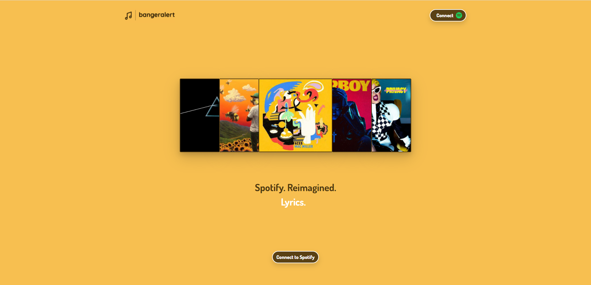
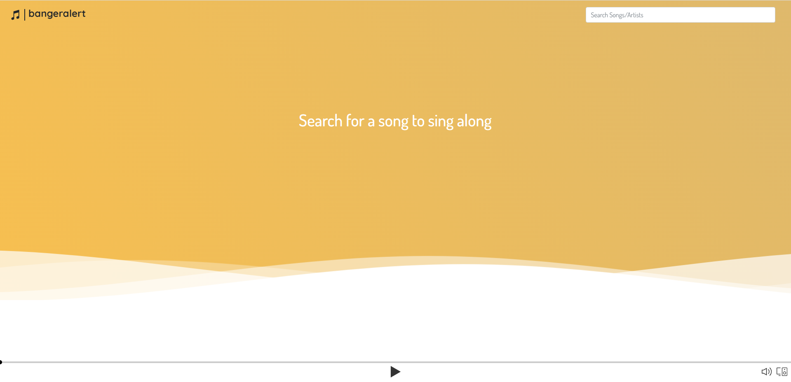
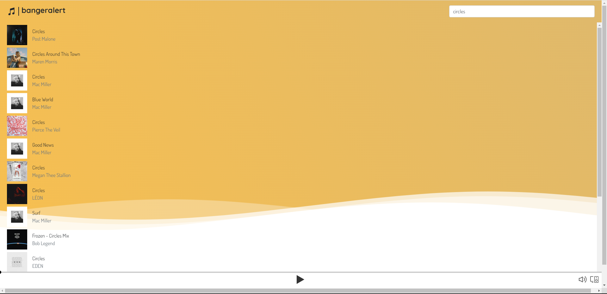
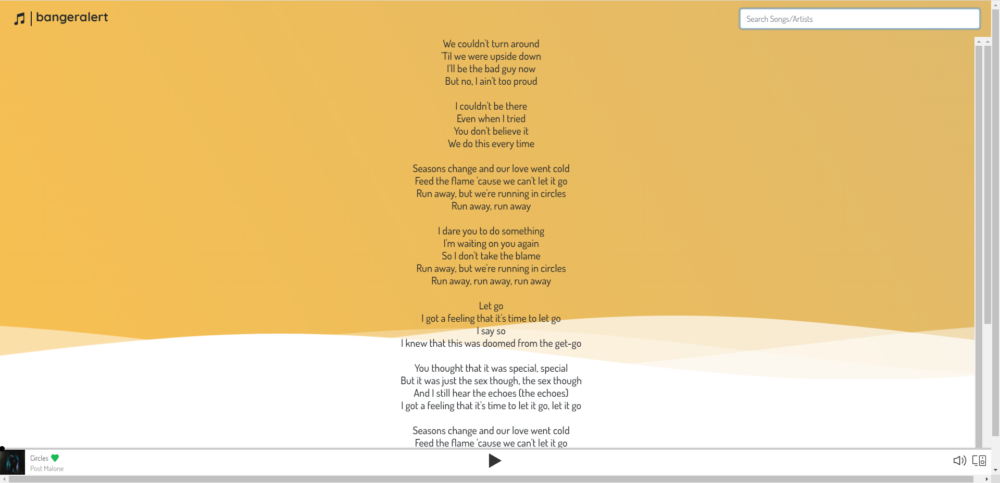

# Banger Alert!!
Final Project with the Fantastic Four

This is Banger Alert, a React front end client that communicates with the Spotify API.


## Objective
Build an application where the user is able to listen to their favorite artists/songs and make it easy to sing along with.









  ## Table of Contents 
- [Objective](#objective)
- [License](#license)
- [Description](#description)
- [Deployment](#deployment)
- [Local](#local)
- [Githubs](#githubs)

## License
[](https://opensource.org/licenses/MIT)

## Description

BangerAlert is a Spotify Companion App that hosts a new wrapper and displays lyrics to sing along with. The application uses the Spotify API to provide a simple interface to enhance the listening experience.

## Deployment

### ### NOTE: A SPOTIFY PREMIUM ACCOUNT IS REQUIRED ### ####

https://banger-alert-redux.herokuapp.com/

## Local

If you wish to host this application locally there is a few steps you need to take. 
1. Have a Spotify Premium Account
2. Create Local Application Instance in the Spotify Developer Dashboard
3. Set your redirect URI to `http://localhost:3000/`
4. Finally run the application locally through the terminal.
```
npm i
npm run install
npm run develop
visit http://localhost:3000/
```

### Built With

* [React.js](https://reactjs.org/)
* [Bootstrap](https://getbootstrap.com)
* [HTML](https://developer.mozilla.org/en-US/docs/Web/HTML)
* [CSS](https://developer.mozilla.org/en-US/docs/Web/CSS)
* [Javascript](https://developer.mozilla.org/en-US/docs/Web/JavaScript)
* [Node.js](https://nodejs.org/en/)
* [DOTENV](https://www.npmjs.com/package/dotenv)
* [Express](https://www.npmjs.com/package/express)

## Authors

Contributors names and contact info:

* [Kamyar](https://github.com/Kam-Mivehchi)
* [Omar](https://github.com/OmarAce)
* [Nick](https://github.com/nicholasamarillo)
* [Runa](https://github.com/runaariga)
